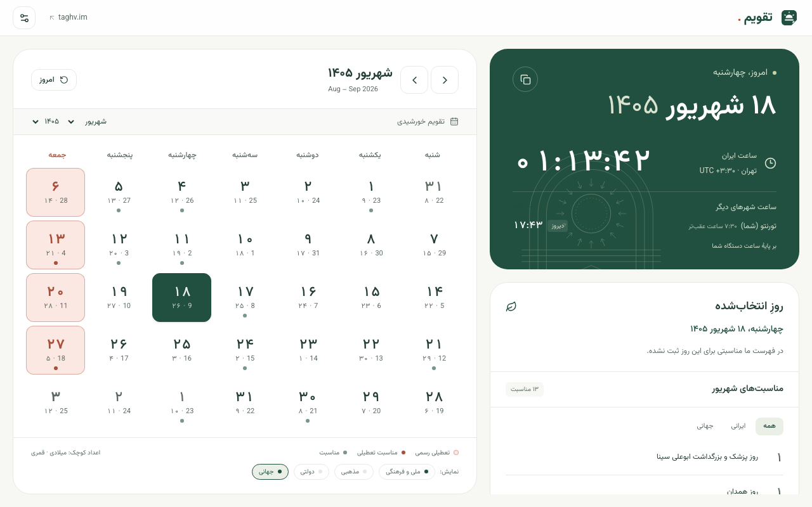
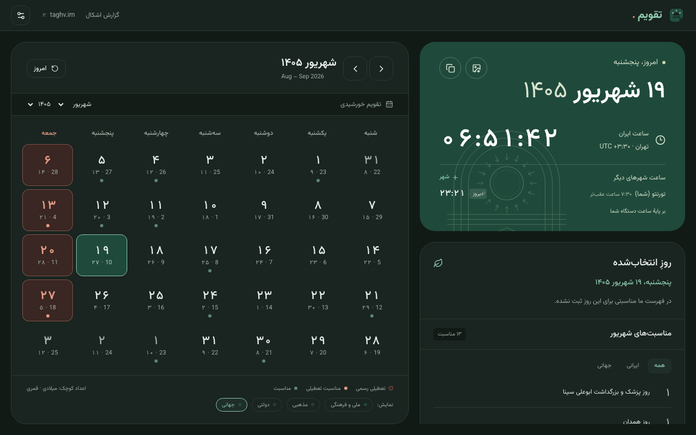
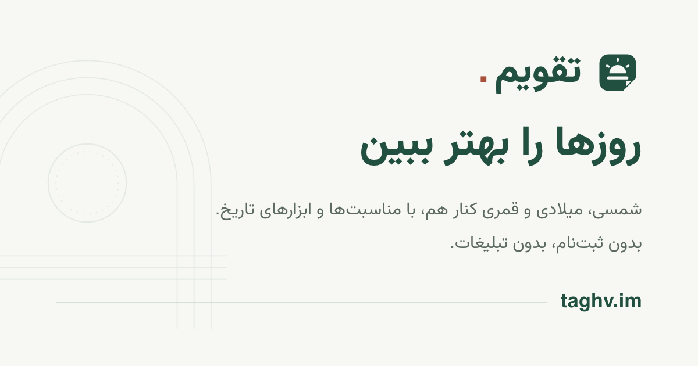

<div align="center">


# تقویم · Taghvim

**روزها را بهتر ببین.**

تقویم ایرانی، راست‌چین و فارسی — بدون ثبت‌نام، بدون تبلیغات، بدون پایگاه داده.

[**taghv.im**](https://taghv.im) · [تغییرات](https://taghv.im/changelog) · [درباره](https://taghv.im/about) · [مشارکت](CONTRIBUTING.md) · [امنیت](SECURITY.md)

<br />


</div>

<div dir="rtl">

---

## فهرست

- [تقویم چیست](#تقویم-چیست)
- [امکانات](#امکانات)
- [تصویرها](#تصویرها)
- [فناوری‌ها](#فناوریها)
- [ساختار پروژه](#ساختار-پروژه)
- [شروع کار](#شروع-کار)
- [تست](#تست)
- [مشارکت](#مشارکت)
- [انتشار و سنجش فایل‌ها](#انتشار-و-سنجش-فایلها)
- [حریم خصوصی](#حریم-خصوصی)
- [ملاحظات داده](#ملاحظات-داده)
- [مجوز](#مجوز)
- [نگهدارنده](#نگهدارنده)

## تقویم چیست

تقویم یک تقویم فارسی و راست‌چین برای وب است: شمسی، میلادی و قمری کنار هم، مناسبت‌های ایرانی، و چند ابزار تاریخ. نسخهٔ اصلی روی [taghv.im](https://taghv.im) است؛ همان کد به‌صورت افزونهٔ کروم و فایرفاکس و برنامهٔ اندروید هم منتشر می‌شود.

برای کسی است که تاریخ امروز، مناسبت‌ها و تعطیلی‌ها را بدون تبلیغ و بدون ساختن حساب می‌خواهد، و برای توسعه‌دهنده‌ای که منطق تقویم شمسی را با تست‌های خودکار و منطقهٔ زمانی تهران لازم دارد.

### چرا

تقویم‌های فارسیِ موجود شلوغ‌اند: تبلیغات، پاپ‌آپ، و ده‌ها چیزی که کسی نخواسته. اینجا فقط روز، تاریخ، مناسبت و چند ابزار هست.

اصول پروژه:

- **بدون حساب کاربری.** چیزی برای ثبت‌نام یا ورود وجود ندارد.
- **بدون تبلیغات و بدون ابزار آماری.**
- **بدون پایگاه داده.** تنظیمات فقط در مرورگر خودت می‌ماند.
- **صریح دربارهٔ محدودیت‌ها.** هر جا داده تقریبی یا ناقص است، خود اپ این را می‌گوید (بخش [ملاحظات داده](#ملاحظات-داده)).

## امکانات

| | |
| --- | --- |
| **سه تقویم هم‌زمان** | شمسی، میلادی و قمری — در سربرگ، و زیر هر خانهٔ ماه |
| **ساعت زندهٔ تهران** | ثانیه‌به‌ثانیه، با تشخیص خودکار تغییر روز در نیمه‌شب تهران |
| **ساعت شهرهای دیگر** | ساعت خودت به‌صورت خودکار وقتی منطقهٔ زمانی‌ات با تهران فرق دارد، به‌علاوهٔ تا دو شهر دلخواه |
| **برج فلکی** | برج هر روز، با نشان SVG. ماه‌های خورشیدی همان برج‌هایند؛ شهریور یعنی سنبله |
| **مناسبت‌ها** | ملی و فرهنگی همیشه روشن؛ کلیدهای مستقل مذهبی، دولتی و جهانی زیر تقویم |
| **یادبود جاویدنامان** | در هر بارگذاری، نام و عکس یکی از جان‌باختگان ۱۸ و ۱۹ دی |
| **ابزارهای تاریخ** | تعطیلات پیوسته، روزشمار، تاریخ‌های من، تبدیل بین سه تقویم، فاصلهٔ دو تاریخ، محاسبهٔ سن |
| **تعطیلات پیوسته** | صفحهٔ `/bridges` با نمای سالانه؛ فقط بر اساس مناسبت‌هایی که روشن کرده‌ای |
| **کارت روز** | تصویر روز در خود مرورگر ساخته و به اشتراک گذاشته یا دانلود می‌شود؛ هیچ فایلی بارگذاری نمی‌شود |
| **اوقات شرعی** | ۱۲ شهر ایران، با روش محاسبهٔ تهران (اختیاری) |
| **پوسته و قلم** | تیره/روشن/خودکار، سه اندازهٔ قلم، پنج قلم فارسی |
| **افزونهٔ کروم و فایرفاکس** | `extension/` — تب جدید با تقویم؛ بدون مجوز، بدون شبکه. ساخت با `npm run build:extension` |
| **برنامهٔ اندروید** | `mobile/` — همان صفحهٔ افزونه در Capacitor، با ویجت و بدون مجوز `INTERNET` |
| **پیش‌نمایش اشتراک‌گذاری** | `public/og.png` با `npm run build:og` ساخته می‌شود؛ رندر با کرومیوم، چون satori خط فارسی را شکل نمی‌دهد |
| **دریافت** | صفحهٔ `/download` — افزودن به صفحهٔ خانه، افزونه‌ها، برنامهٔ اندروید، فهرست اشتراکی؛ هر کدام با وضعیت واقعی |
| **راهنما** | صفحهٔ `/help` با مراحل هر کار: تقویم، مناسبت‌ها، ابزارها، نصب روی گوشی و اشتراک تقویم |
| **اشتراک تقویم** | `/calendar.ics` برای افزودن مناسبت‌های ملی و فرهنگی به تقویم گوگل و اپل — بدون تعطیلات قمری |
| **دسترس‌پذیری** | ناوبری کامل با کیبورد، تست خودکار axe در هر دو پوسته |

### پیش‌فرض ایران عزیز

مناسبت‌های مذهبی و دولتی — و پنل اوقات شرعی — به‌صورت پیش‌فرض نمایش داده **نمی‌شوند**. در راهنمای زیر تقویم، کلیدهای مستقل «مذهبی»، «دولتی»، «جهانی» و «یادبود» قرار دارند. کلید مذهبی، اوقات شرعی را هم نمایش می‌دهد. جهانی و یادبود به‌صورت پیش‌فرض روشن‌اند؛ ملی و فرهنگی همیشه نمایش داده می‌شود.

`eventsForDate(date, groups)` ردیف‌های هر گروه خاموش را **کامل** حذف می‌کند — همراه با پرچم تعطیلی — تا گرید هیچ روزی را رنگ نکند که نتواند توضیحش دهد. انتخاب‌ها در `taghvim-view` ذخیره می‌شوند. تنظیم قدیمی `taghvim-scope` خودکار منتقل و پس از ذخیرهٔ موفق حذف می‌شود.

## تصویرها

تب جدید افزونه، که از روی بستهٔ ساخته‌شده رندر می‌شود (`npm run package:extension`):

<p align="center">
  
</p>
<p align="center">
  
</p>

پیش‌نمایش اشتراک‌گذاری سایت (`public/og.png`):

<p align="center">
  
</p>

## فناوری‌ها

نسخه‌ها همان‌هایی است که در `package.json` قفل شده‌اند.

| بخش | فناوری |
| --- | --- |
| فریم‌ورک | Next.js `16.3.3` (App Router) |
| رابط | React `19.2.8`، lucide-react `1.37.0` |
| زبان | TypeScript `5.9.3` |
| استایل | Tailwind CSS `4.3.3` |
| تاریخ و اوقات | jalaali-js `2.0.1`، adhan `4.4.4`، تقویم `islamic-civil` در `Intl` برای قمری |
| افزونه و برنامه | Vite `8.2.2`، Capacitor `8.5.1` |
| تست | Vitest `4.1.11`، Playwright `1.62.1`، `@axe-core/playwright` `4.13.0` |
| قلم | Vazirmatn · Shabnam · Sahel (OFL) · IRANSansX · IRANYekanX (تجاری، دارای مجوز) — همه با میزبانی محلی |
| اجرا | Node.js 26 (همان نسخه‌ای که workflow انتشار استفاده می‌کند) |

## ساختار پروژه

```
src/
├── app/
│   ├── page.tsx              صفحهٔ اصلی (force-dynamic؛ انتخاب یادبود سمت سرور)
│   ├── layout.tsx            RTL، متادیتا، اسکریپت اعمال تنظیمات پیش از رندر
│   ├── globals.css           توکن‌های رنگ (روشن + تیره)، قلم‌ها، اندازه‌ها
│   ├── about/ contact/ changelog/ help/ download/ bridges/
│   ├── products/ services/ support/
│   ├── calendar.ics/         فید اشتراک تقویم
│   ├── fonts/                دو قلم تجاری، با توضیح مجوز در README همان پوشه
│   └── icon.svg              نشان طلوع/برگ تقویم
├── components/
│   ├── calendar-app.tsx      وضعیت کلی: ساعت، روز انتخابی، ماه، گروه‌ها و پنل‌ها
│   ├── calendar-panel.tsx    گرید ماهانه، ناوبری کیبورد RTL
│   ├── today-panel.tsx       سربرگ امروز + ساعت زنده
│   ├── events-panel.tsx      مناسبت‌های روز و ماه
│   ├── tools-panel.tsx       تعطیلات پیوسته / روزشمار / تاریخ‌های من / تبدیل / فاصله / سن
│   ├── memorial-panel.tsx    یادبود جاویدنامان
│   ├── prayer-panel.tsx      اوقات شرعی
│   ├── world-clocks.tsx      ساعت خودت و تا دو شهر دلخواه
│   ├── day-card.tsx          کارت روز، رسم‌شده روی canvas
│   ├── zodiac-icon.tsx       نشان SVG برج، از مجموعهٔ lucide
│   ├── settings-menu.tsx     پوسته، اندازهٔ قلم، قلم
│   └── site-header.tsx site-footer.tsx
├── lib/                      هستهٔ منطق — بیشتر فایل‌ها با تست کنارشان
│   ├── calendar.ts           تبدیل و قالب‌بندی سه تقویم، گرید ماه
│   ├── events.ts             مناسبت‌ها + فیلتر مستقل گروه‌ها
│   ├── view.ts               تنظیمات گروه‌ها و یادبود + مهاجرت انتخاب قبلی
│   ├── bridges.ts countdown.ts   تعطیلات پیوسته و روزشمار
│   ├── dates.ts              تاریخ‌های شخصی
│   ├── ics.ts                ساخت فید iCalendar
│   ├── prayer.ts             اوقات شرعی با Adhan
│   ├── javidnaman.ts         خواندن snapshot و انتخاب تصادفی
│   ├── preferences.ts        اعتبارسنجی و اعمال تنظیمات نمایش
│   ├── clocks.ts             منطقه‌های زمانی، اختلاف با تهران، فهرست ذخیره‌شده
│   ├── zodiac.ts             نگاشت ماه خورشیدی به برج فلکی
│   ├── changelog.ts          تاریخچهٔ نسخه‌ها
│   └── date-tools.ts         نرمال‌سازی ارقام، محاسبهٔ سن
├── data/javidnaman.json      snapshot کامیت‌شده
extension/                    افزونهٔ کروم و فایرفاکس (Vite، از همان کد src)
mobile/                       برنامه‌ها و ویجت‌های اندروید و آیفون (Capacitor، Kotlin، Swift)
scripts/                      ساخت آیکن، تصویر اشتراک، دادهٔ ویجت، بسته‌بندی و امضا
tests/                        تست‌های مرورگر (Playwright)
.github/workflows/release.yml ساخت فایل‌های انتشار روی GitHub Actions
```

توضیح بیشتر: [`extension/README.md`](extension/README.md) و [`mobile/README.md`](mobile/README.md).

### قواعد ثابت

اینها تصمیم‌های گرفته‌شده‌اند، نه جزئیات پیاده‌سازی. شکستن هرکدام یعنی باگ:

- **زمان.** هر لحظه به‌عنوان روز مدنی در `Asia/Tehran` تفسیر می‌شود، نه منطقهٔ زمانی ماشین. تبدیل‌ها ظهر UTC برمی‌گردند تا پایدار بمانند.
- **بازه.** سال‌های ۱۲۰۰ تا ۱۶۰۰ شمسی. خانه‌های خارج از بازه در UI غیرفعال‌اند و هرگز به توابع بازه‌دار پاس داده نمی‌شوند.
- **هفته.** از شنبه شروع می‌شود، با پرکنندهٔ ماه‌های مجاور.
- **رنگ.** هر رنگ باید یک توکن از `globals.css` باشد. `bg-white` یا هگز مستقیم در کامپوننت ممنوع است — هر توکن معادل تیره دارد و axe در هر دو پوسته اجرا می‌شود.
- **اندازه.** هر اندازهٔ متن با `rem`، تا تنظیم اندازهٔ قلم کل صفحه را مقیاس کند.
- **ذخیره‌سازی.** فقط `localStorage` مرورگر، با کلیدهایی که در بخش [حریم خصوصی](#حریم-خصوصی) آمده. هر دسترسی داخل `try/catch` است.
- **بدون بک‌اند.** بدون حساب، بدون احراز هویت، بدون پایگاه داده. اگر چیزی به این‌ها نیاز داشت، ساخته نمی‌شود.

هر فایل کد با یک هدر `Source / Version / Why / Env-Deps` شروع می‌شود. جزئیات کامل در [`AGENTS.md`](AGENTS.md).

## شروع کار

پیش‌نیاز: Node.js 26 و npm.

```bash
git clone https://github.com/farjadp/taghvim.git
cd taghvim
npm install
npm run dev -- --port 3100
```

سپس `http://127.0.0.1:3100`.

> پورت `3000` روی ماشین توسعه اشغال است؛ به همین دلیل `3100`. تست‌های مرورگر هم پیش‌فرض روی `3100` اجرا می‌شوند.

### اسکریپت‌ها

| دستور | کار |
| --- | --- |
| `npm run dev -- --port 3100` | سرور توسعه |
| `npm test` | تست‌های واحد (Vitest) |
| `npm run typecheck` | بررسی نوع‌ها |
| `npm run build` | ساخت نسخهٔ تولید |
| `npm run test:e2e` | تست‌های مرورگر (Playwright، دسکتاپ + موبایل) |
| `npm run build:extension` | ساخت افزونهٔ کروم در `extension/dist` و بررسی بسته |
| `npm run build:extension:firefox` | همان کد با مانیفست فایرفاکس در `extension/dist-firefox` |
| `npm run sync:javidnaman` | به‌روزرسانی دستیِ فهرست جاویدنامان از منبع |

فهرست کامل دستورها در [`AGENTS.md`](AGENTS.md#commands).

برای تست‌های مرورگر، یک‌بار: `npx playwright install chromium`

## تست

پروژه یک مجموعه تست خودکار با Vitest و Playwright دارد.

- **تست‌های واحد** (`src/lib/*.test.ts`) روی هستهٔ منطق — تبدیل تاریخ، مرزهای بازه، گروه‌های مناسبت‌ها، تعطیلات پیوسته، فید `.ics`، مهاجرت تنظیمات، اوقات شرعی، دادهٔ ویجت و صحت چنج‌لاگ.
- **تست‌های مرورگر** (`tests/`) روی دسکتاپ و iPhone 13 — ناوبری، ابزارها، کلیدهای مستقل، مهاجرت تنظیمات، تغییر روز در نیمه‌شب، سرریز افقی و خطاهای کنسول. `tests/extension.spec.ts` بستهٔ ساخته‌شدهٔ افزونه را با همهٔ مبدأهای دیگر مسدود اجرا می‌کند. پروژهٔ `firefox` همین تست را روی بستهٔ فایرفاکس در Gecko واقعی اجرا می‌کند (`npx playwright install firefox`).
- **دسترس‌پذیری:** axe در تست‌های مرورگر، در پوستهٔ روشن **و** تیره.

پیش از هر Pull Request:

```bash
npm run typecheck && npm test && npm run build && npm run test:e2e
```

اگر به افزونه دست زده‌ای، `npm run build:extension` را هم اجرا کن؛ بررسی بسته بعد از ساخت خودش انجام می‌شود.

## مشارکت

مشارکت خوش‌آمد است. پیش از شروع [`CONTRIBUTING.md`](CONTRIBUTING.md) را بخوان: راه‌اندازی، قواعد تاریخ و منطقهٔ زمانی، RTL، دسترس‌پذیری و انتظار از Pull Request آنجا آمده. قواعد معماری پروژه در [`AGENTS.md`](AGENTS.md) است. برای گزارش مشکل امنیتی [`SECURITY.md`](SECURITY.md) را ببین.

## انتشار و سنجش فایل‌ها

- **سایت** روی [Railway](https://railway.app) از شاخهٔ `main` مستقر می‌شود. سرور تولید به `0.0.0.0` بایند می‌شود و `PORT` پلتفرم را می‌خواند.
- **فایل‌های منتشرشده** (زیپ افزونهٔ کروم و فایرفاکس، زیپ کد منبع، APK اندروید) از نسخهٔ ۰٫۹٫۳۹ به بعد روی سیستم شخصی ساخته نمی‌شوند. تگ `v<نسخهٔ package.json>` فایل [`.github/workflows/release.yml`](.github/workflows/release.yml) را اجرا می‌کند: همهٔ فایل‌ها از همان commit ساخته می‌شوند، برای هرکدام گواهی ساخت (build provenance attestation) صادر می‌شود، `SHA256SUMS` نوشته می‌شود و یک release پیش‌نویس باز می‌شود.
- **APK** در GitHub بدون امضا ساخته می‌شود، چون کلید امضا نباید در هیچ سرویسی باشد. `scripts/sign-release-apk.mjs` همان فایل را پس از بررسی گواهی‌اش امضا می‌کند.

روش سنجیدن هر فایل، و اینکه این سنجش چه چیزی را ثابت **نمی‌کند**: [`VERIFY.md`](VERIFY.md).

## حریم خصوصی

آنچه اینجا آمده از روی کد بررسی شده؛ متن رسمی در [taghv.im/about#privacy](https://taghv.im/about#privacy) است.

- **حساب کاربری لازم نیست.** ثبت‌نام، ورود و احراز هویت وجود ندارد.
- **بدون تبلیغات و بدون ابزار آماری.**
- **پایگاه دادهٔ کاربران وجود ندارد.** سرور چیزی از تنظیمات یا تاریخ‌های تو نگه نمی‌دارد.
- **`localStorage`:** تنظیمات فقط در مرورگر خودت ذخیره می‌شوند: `taghvim-city`، `taghvim-view`، `taghvim-theme`، `taghvim-accent`، `taghvim-motif`، `taghvim-size`، `taghvim-font`، `taghvim-clocks` و `taghvim-card`. اگر در «تاریخ‌های من» تولد یا سالگردی وارد کنی، عنوان و تاریخش در `taghvim-dates` ذخیره می‌شود؛ این تنها کلیدی است که محتوا دارد، نه تنظیم. کلید قدیمی `taghvim-scope` فقط برای مهاجرت خوانده و بعد حذف می‌شود. پاک کردن دادهٔ سایت در مرورگر همه را پاک می‌کند.
- **درخواست‌های بیرونی:** تنها چیزی که از بیرون بارگذاری می‌شود، عکس بخش یادبود است که از CDN منبع می‌آید (با `referrerPolicy="no-referrer"`، پس نشانی صفحه فرستاده نمی‌شود؛ ولی آن سرویس آی‌پی تو را می‌بیند). با خاموش کردن کلید «یادبود»، دیگر هیچ درخواستی به بیرون نمی‌رود. قلم‌ها، آیکن‌ها و عکس‌های پس‌زمینهٔ کارت روز روی همین سرور میزبانی می‌شوند.
- **افزونه و برنامهٔ اندروید** هیچ درخواست شبکه‌ای نمی‌فرستند: افزونه هیچ مجوزی ندارد و `scripts/check-extension.mjs` بعد از هر ساخت نبودن `fetch` و نشانی خارجی را بررسی می‌کند؛ مانیفست اندروید مجوز `INTERNET` ندارد.
- **گزارش اشکال** فقط یک لینک `mailto:` است؛ فرم و سرویس ثالثی در کار نیست.
- **میزبانی:** مثل هر سایتی، سرور میزبان لاگ‌های فنی معمول را نگه می‌دارد.

## ملاحظات داده

پروژه دربارهٔ چیزی که نمی‌داند صریح است:

- تاریخ‌های **قمری** با تقویم محاسباتی `islamic-civil` درمی‌آیند، نه رؤیت هلال. ممکن است با تقویم رسمی ایران تا یک روز تفاوت داشته باشند. برای سال‌های ۱۴۰۰ تا ۱۴۲۰ تعطیلات قمری از `src/data/official-lunar.json` خوانده می‌شوند، و `OFFICIAL_LUNAR_OVERRIDES` هم سه تاریخ از سال ۱۴۰۵ را به تقویم رسمی پین می‌کند؛ بقیه محاسباتی‌اند.
- **مناسبت‌ها** مجموعه‌ای برگزیده و تکرارشونده‌اند، نه تقویم رسمیِ کامل.
- **اوقات شرعی** تقریبی‌اند: روش محاسبهٔ تهران با مختصات شهر. نیمه‌شب شرعی میانگین غروب تا فجر روز بعد است.
- **ساعت** از ساعت دستگاه در زمان تهران می‌آید، نه همگام‌سازی NTP.
- **فهرست جاویدنامان** یک snapshot کامیت‌شده از [javidnaman.iranintl.com](https://javidnaman.iranintl.com/memorial) است و فقط نام‌های **شناسایی‌شده** را دارد، نه همهٔ جان‌باختگان. عکس‌ها مستقیماً از سرور همان سایت بارگذاری می‌شوند و چیزی اینجا ذخیره نمی‌شود.

همین هشدارها داخل خود اپ هم نمایش داده می‌شوند و نباید حذف شوند.

## سیستم بصری

| | |
| --- | --- |
| پس‌زمینه | `#f7f8f4` |
| سبز اصلی | `#214f40` |
| متن | `#243e34` |
| اکسنت سفالی | `#a9503b` |
| قلم | Vazirmatn · Shabnam · Sahel (OFL) · IRANSansX · IRANYekanX (تجاری، دارای مجوز) — همه با میزبانی محلی |

بدون گرادیان، بدون بلور اضافی، بدون کارت تودرتو. پالت تیرهٔ متناظر برای همهٔ توکن‌ها.

## مجوز

کد این پروژه با مجوز [MIT](LICENSE) منتشر می‌شود.

این مجوز شامل موارد زیر **نمی‌شود**؛ هرکدام تابع مجوز یا مالکیت خودش است:

- **قلم‌های IRANSansX و IRANYekanX** (`src/app/fonts/`): قلم‌های تجاری [fontiran.com](https://fontiran.com) که با مجوز خریداری‌شده به کار رفته‌اند. استفادهٔ دوباره از این دو فایل تابع مجوز خودشان است، نه این ریپو. توضیح در [`src/app/fonts/README.md`](src/app/fonts/README.md).
- **وزیرمتن، شبنم و ساحل** با مجوز [SIL OFL](https://scripts.sil.org/OFL) از npm نصب می‌شوند.
- **نام‌ها و عکس‌های بخش یادبود** (`src/data/javidnaman.json` و عکس‌های CDN منبع) متعلق به منبع خود هستند.
- **عکس‌های پس‌زمینهٔ کارت روز** (`public/backgrounds/`) متعلق به صاحبان خودشان هستند و با این مجوز منتشر نمی‌شوند.
- **پورت‌های Kotlin و Swift تبدیل جلالی** (`mobile/*/Jalali.*`) خط‌به‌خط از [jalaali-js](https://github.com/jalaali/jalaali-js) 2.0.1 (MIT، Copyright (c) 2020 Behrang Norouzinia) ترجمه شده‌اند.
- وابستگی‌های npm مجوزهای خودشان را دارند.

## نگهدارنده

فرجاد پورمحمد (Farjad Pour Mohammad) · GitHub: [@farjadp](https://github.com/farjadp)

</div>

---

<div align="center">

**Taghvim** — a Persian (Jalali) calendar for the web.
Jalali, Gregorian and Hijri side by side · curated Iranian occasions · date tools · dark mode.
No accounts, no ads, no database, no tracking.

Built with Next.js 16 · React 19 · TypeScript · Tailwind v4 · MIT licensed
by [Farjad Pour Mohammad](https://github.com/farjadp) at [AshaVid](https://www.ashavid.ca)

</div>
